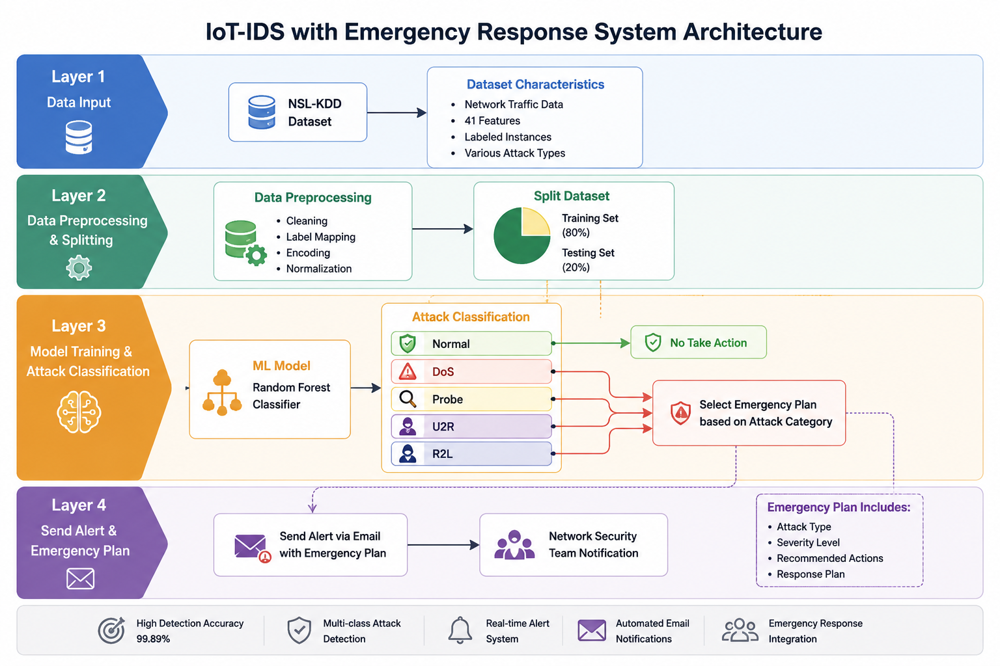
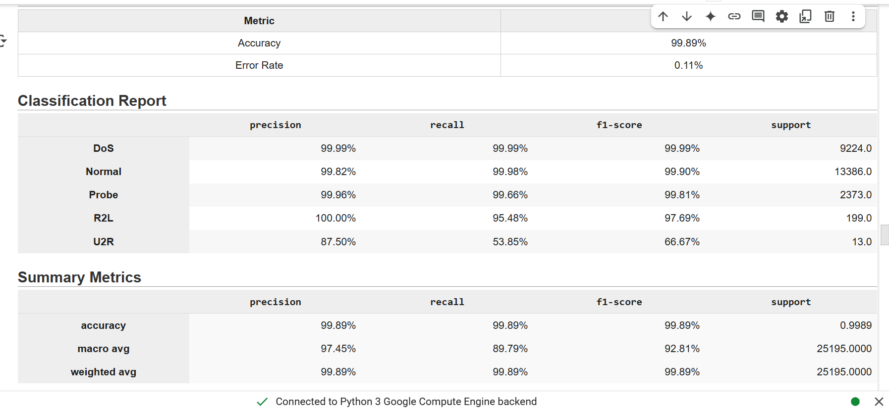

# AI-Powered Intrusion Detection System (IDS) with Automated Emergency Response for IoT Environments

A Machine Learning-based Intrusion Detection System (IDS) designed for IoT environments. The system utilizes a Random Forest classifier trained on the NSL-KDD dataset to detect and classify network attacks, generate security alerts, and provide automated emergency response recommendations.

---

## Project Overview

Traditional intrusion detection systems focus primarily on identifying malicious activities and generating alerts. This project extends conventional IDS capabilities by integrating an automated emergency response feature that assists security teams in responding to detected threats more efficiently.

The proposed solution combines machine learning-based attack detection with predefined response procedures to support faster incident handling in IoT environments.

---

## System Architecture

The system follows a four-layer architecture:

1. Data Collection and Input
2. Data Preprocessing and Dataset Splitting
3. Attack Detection and Classification using Random Forest
4. Alert Generation and Emergency Response Recommendation

---

## Detection Performance

The detection model was evaluated using the NSL-KDD dataset and achieved the following results:

* Detection Accuracy: **99.89%**
* Error Rate: **0.11%**
* Multi-Class Attack Classification
* Real-Time Security Alert Generation

Supported attack categories:

* Denial of Service (DoS)
* Probe
* Remote to Local (R2L)
* User to Root (U2R)

---

## Automated Emergency Response

When suspicious activity is detected, the system generates a security alert and provides response recommendations based on the identified attack category.

Response recommendations may include:

* Blocking suspicious IP addresses
* Isolating affected devices
* Resetting compromised credentials
* Escalating incidents to the security team

The emergency response framework was developed in alignment with National Cybersecurity Authority (NCA) cybersecurity guidance.

---

## Technologies Used

* Python
* Scikit-Learn
* Pandas
* NumPy
* Random Forest
* Machine Learning
* IoT Security
* Network Traffic Analysis

---

## Project Highlights

* AI-powered intrusion detection for IoT environments
* Automated security alert generation
* Emergency response recommendation framework
* Multi-class attack classification
* Detection accuracy of 99.89%
* Alignment with NCA cybersecurity practices

---
